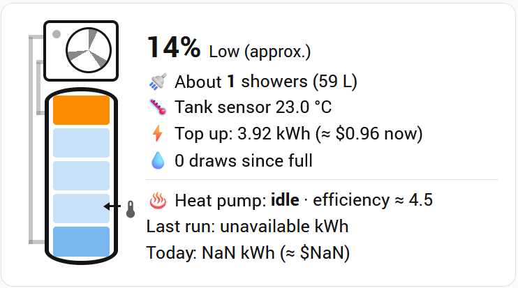

# Reclaim Tank Insights for Home Assistant (unofficial)

> **Status: experimental (v0.1.0).** The model is calibrated from one household so far.
> Feedback and shared run data are very welcome (see [Help improve the model](#help-improve-the-model)).

A companion to the [Reclaim Energy integration](https://github.com/david-collett/reclaimenergy)
by David Collett. It turns the Reclaim heat pump's data into an estimate of **how much hot water
is actually left in your tank**, with a dashboard card that draws your tank and heat pump.



Not affiliated with or endorsed by Reclaim Energy.

## Why

A Reclaim tank has one temperature sensor, about a third of the way up the tank. After the first
few showers it reads cold, even though the top of the tank can still be full of 60 °C water. On its
own, the reading doesn't tell you whether there's enough hot water for the next shower.

This project combines that sensor with the heat pump's energy use and the ambient temperature to
estimate:

- **Tank charge** (%), plus **litres of hot water** and **showers left**
- **Energy and cost to top up** now (with Amber Electric or any price sensor, or no pricing at all)
- **Heating progress** while the heat pump runs
- **Draws since the last full heat,** and when the tank was last full
- **Heat pump** run energy and cost, today's totals, and an efficiency estimate
- **Maintenance reminders:** anode check (glass-lined tanks) and pressure-relief valve
- **Full-heat check:** a warning if the tank hasn't reached full temperature for 7 days

## How the model works

A stratified hot water tank holds hot water at the top and cold at the bottom, separated by a
narrow transition band. Hot water is drawn from the top and cold mains water refills from the
bottom, pushing the band upward.

- **After a completed heat,** the tank is full. The heat pump stops when the tank sensor reaches
  about 59 °C.
- **Between heats,** the charge is estimated from the tank sensor with a calibrated curve. Because
  the sensor sits about a third of the way up, roughly the first quarter of the tank can be used
  before the sensor responds. So the model only reports 100 % when the sensor is high *and* no
  draws have been detected since the last full heat.
- **While heating,** the charge is the charge at the start plus
  (electricity used × efficiency ÷ energy for a full heat).
- **Energy for a full heat** = tank volume × 4.186 kJ/L·°C × (60 °C − mains temperature).
  For a 420 L tank and 18 °C mains water, that's about 20.5 kWh of heat.
- **Efficiency (COP)** is modelled as 3.1 + 0.097 × ambient °C, clamped to 3.0–6.5. It was
  calibrated from real heating runs on an EHPE-4550P-A heat pump, and is consistent with that
  unit's rated COP of 6.02 at 32.6 °C ambient.

### Calibration basis

The first calibration used 7 complete morning heating runs from one RE400AGLH / EHPE-4550P-A
system in Sydney (September 2026). Three runs that started from a near-empty tank each needed
almost exactly the theoretical energy for a full heat, which supports the efficiency model.

The tank sensor sits at about a third of the tank's height on **every** Reclaim tank model, so the
curve's shape should carry across models. The volume and dimensions come from Reclaim's published
tank specification sheet.

### Limitations

- **After heavy use,** the tank sensor bottoms out near mains temperature, so "15 % left" and
  "35 % left" look similar. The card shows "(approx.)" when the reading is in the less certain range.
- **The middle of the curve** (tank sensor between about 30 and 50 °C) rests on the fewest data
  points so far.
- **Draw detection** counts drops of 3 °C or more while idle. Slow standing heat loss over a long,
  quiet day can occasionally add one extra count.
- **Costs** use the grid price. While you're exporting solar, the true cost of heating is the
  feed-in income you give up, which is usually lower.
- **The efficiency model** is calibrated on the EHPE-4550P-A. Other Reclaim heat pumps are likely
  similar but unverified.

## Requirements

- Home Assistant 2026.9 or later
- The [Reclaim Energy integration](https://github.com/david-collett/reclaimenergy), set up and working
- [button-card](https://github.com/custom-cards/button-card), installed through HACS (for the dashboard card)
- Packages enabled in `configuration.yaml`

## Installation

### 1. Enable packages

If your `configuration.yaml` doesn't already load packages, add this under `homeassistant:`:

```yaml
homeassistant:
  packages: !include_dir_named packages
```

### 2. Copy the files

| From this repository | To your Home Assistant config folder |
|---|---|
| `packages/reclaim_tank_insights.yaml` | `/config/packages/reclaim_tank_insights.yaml` |
| `custom_templates/reclaim_tank.jinja` | `/config/custom_templates/reclaim_tank.jinja` |

Create the `packages` and `custom_templates` folders if they don't exist.

### 3. Check your entity IDs

The files use these Reclaim Energy entity IDs:

| Purpose | Entity ID used |
|---|---|
| Heat pump running | `binary_sensor.reclaim_v2_heat_pump_state` |
| Tank water temperature | `sensor.reclaim_v2_water_temperature` |
| Ambient temperature | `sensor.reclaim_v2_ambient_temperature` |
| Heat pump energy (cumulative) | `sensor.back_garden_reclaim_v2_hot_water_heat_pump_energy_consumption` |
| Heat pump power | `sensor.reclaim_v2_power` |
| Inlet and outlet temperatures, compressor and pump speed (detailed log only) | `sensor.reclaim_v2_inlet_temperature` and similar |

Your IDs may differ, especially the energy sensor, whose ID includes the device's area on some
installs. Find yours under **Settings > Devices & services > Reclaim Energy**. If any differ:

- Edit them once in `custom_templates/reclaim_tank.jinja` (the `reclaim_entity` macro at the top).
- Edit every line marked `# EDIT` in `packages/reclaim_tank_insights.yaml`. These are triggers,
  which can't read IDs from the shared file.
- Edit the `variables` at the top of the card.

### 4. Check the configuration and restart

Go to **Developer Tools > YAML > Check configuration**, then restart Home Assistant.

### 5. Set your tank model and options

In **Settings > Devices & services > Helpers**, set:

| Helper | What to set |
|---|---|
| Reclaim tank model | Your tank model (from the label on the tank) |
| Reclaim litres of tank water per shower | Optional. 0 means the default of 35 L, which suits a typical shower mixed to about 40 °C |
| Reclaim mains water temperature | Optional. 0 means the default of 18 °C. Lower this in winter if your mains water gets colder |
| Reclaim price entity | Blank to auto-detect the Amber Electric price sensor, an entity ID for another price sensor (AUD/kWh), or `none` to turn pricing off |
| Reclaim anode last checked or replaced | Optional (glass-lined tanks). Enables the anode reminder |
| Reclaim relief valve last operated | Optional. Enables the relief valve reminder |

### 6. Add the card

Add a **Manual** card to your dashboard and paste the contents of `cards/reclaim-tank-card.yaml`.
Set `show_heat_pump: false` for a narrower, tank-only card.

**What the card shows:**

- **The tank,** drawn to your model's real proportions, with five layers that fill from the top
  down: red for hot water, orange for the transition band, pale blue for cold water. When the
  bottom layer isn't hot, it's tinted by the real tank sensor (blue, green or yellow).
- **A thermometer and arrow** marking where the real tank sensor sits.
- **The heat pump** above the tank. While it runs, the fan spins and the pipes light up: red for
  the hot return to the tank top, blue for the flow from the tank bottom.
- **The figures:** charge, showers left, litres, top-up energy and cost, draws since full, heat
  pump power and efficiency, run energy and cost, today's totals, plus any warnings.

## Optional: CSV logging

Home Assistant keeps detailed history for only 10 days by default. To keep the data needed to
re-calibrate the model, the package can write CSV logs using Home Assistant's built-in
**File** integration. The logging automations do nothing until the log targets exist.

1. **Allow the log folder.** Add this under `homeassistant:` in `configuration.yaml`, create the
   folder `/config/reclaim_logs`, and restart:
   ```yaml
   homeassistant:
     allowlist_external_dirs:
       - /config/reclaim_logs
   ```
2. **Add three File notification services** (**Settings > Devices & services > Add integration >
   File > Set up a notification service**), with timestamps off:
   - `/config/reclaim_logs/runs.csv`
   - `/config/reclaim_logs/daily.csv`
   - `/config/reclaim_logs/detail.csv`
3. **Rename the new notify entities** to `notify.reclaim_runs`, `notify.reclaim_daily` and
   `notify.reclaim_detail`.
4. **Optionally turn on** the **Reclaim detailed logging** helper for the detailed log.

The File integration writes a short header when it creates each file; the data lines follow.

**`runs.csv`** has one line per heating run:

`run_start, run_end, start_temp_c, end_temp_c, energy_kwh, ambient_start_c, ambient_end_c, run_cost_aud, draws_before_run, est_start_charge_pct, full_reached, tank_volume_l`

**`daily.csv`** has one line per day, at 23:59:

`date, energy_kwh, cost_aud, charge_pct, draws_since_full, last_full`

**`detail.csv`** has one line per change on the key Reclaim sensors, while detailed logging is on:

`timestamp, entity_id, state`

Detailed logging is roughly 1,000 lines a day, a few MB over several months.

## Help improve the model

The model gets better with runs from different tanks, climates and households. If you'd like to
help, open an issue with:

- your tank and heat pump models;
- your `runs.csv` (or a 10-day History export of the Reclaim sensors);
- any mornings where "showers left" didn't match reality.

The logs contain only tank temperatures, energy and times: no personal data.

## Roadmap

- **A proper companion integration,** configured through the UI instead of YAML
- **Self-calibration:** each completed run refines your household's curve automatically
- **Automation blueprints:** low hot water alerts, and boosting on solar surplus or cheap prices
- **Timer recommendations** adapted to season, solar, prices and household usage patterns
- **Usage insights:** daily hot water volume, estimated from each run's reheat energy

## Credits

- [Reclaim Energy integration](https://github.com/david-collett/reclaimenergy) by David Collett,
  which provides all the sensor data and controls this project builds on
- Tank dimensions from Reclaim Energy's published tank specification sheet
- [button-card](https://github.com/custom-cards/button-card) for the dashboard card

## Disclaimer

All figures are estimates derived from a single tank sensor and a model. Don't rely on them for
anything safety-related. Always follow your Reclaim manual for maintenance intervals and safety.

## License

MIT
